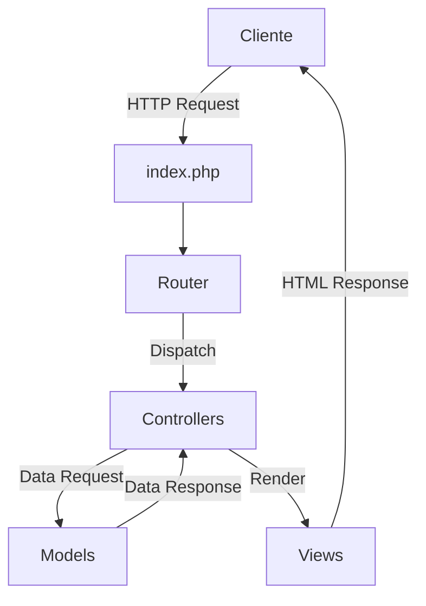

# 🔍 Buscador de Enlaces MVC
## Manual de Implementación y Documentación

Autor: Fredy Magaña
Version: PHP 8.2
fecha:19/11/2024


## Tabla de Contenidos
- [Visión General](#visión-general)
- [Arquitectura](#arquitectura)
- [Instalación](#instalación)
- [Estructura del Proyecto](#estructura-del-proyecto)
- [Base de Datos](#base-de-datos)
- [Guía de Desarrollo](#guía-de-desarrollo)
- [Manual de Usuario](#manual-de-usuario)
- [Despliegue](#despliegue)
- [Mantenimiento](#mantenimiento)

## Visión General

### 🎯 Objetivo
Implementar un buscador de enlaces modular y escalable utilizando el patrón MVC en PHP.

### ✨ Características Principales


- Sistema de búsqueda múltiple
- Interfaz responsiva con Bootstrap 5
- Gestión de errores robusta
- Arquitectura MVC modular

## Arquitectura

### 📐 Diagrama de Arquitectura


### 🗂️ Estructura del Proyecto

```plaintext
enlaces-mvc/
├── 📁 assets/
│   ├── 📁 css/
│   ├── 📁 js/
│   └── 📁 images/
├── 📁 controllers/
├── 📁 models/
├── 📁 views/
├── 📁 config/
├── 📁 docs/
└── 📝 index.php
```

## Instalación

### Requisitos Previos
- PHP 7.4+
- MySQL 5.7+
- Composer
- Apache/Nginx

### Paso a Paso
1. Clonar repositorio:
```bash
git clone https://github.com/yourusername/enlaces-mvc.git
```

2. Instalar dependencias:
```bash
composer install
```

3. Configurar base de datos:
```sql
CREATE DATABASE enlaces1;
```

## Base de Datos

### 📊 Diagrama ER


### Implementación
```sql
CREATE VIEW vista_enlaces AS
SELECT 
    v.pk_vinculo,
    v.enlace,
    v.titulo,
    c.categoria,
    c.tipo
FROM vinculos v
JOIN categoria c ON v.fk_categoria = c.pk_categoria;
```

## Guía de Desarrollo

### 🏗️ Componentes Principales

#### 1. Modelo (ModelBBDD.php)


```php
class ModelBBDD {
    private $conn;
    
    public function __construct() {
        try {
            $this->conn = new PDO(
                "mysql:host=localhost;dbname=enlaces1;charset=utf8",
                "root",
                ""
            );
        } catch(PDOException $e) {
            throw new Exception($e->getMessage());
        }
    }
}
```

#### 2. Controladores


#### 3. Vistas


## Manual de Usuario

### 🖥️ Interfaz Principal


### Funcionalidades

#### 1. Búsqueda por Categoría


#### 2. Búsqueda por Lenguaje


#### 3. Búsqueda por Título


## Despliegue

### 🚀 Proceso de Despliegue
1. Preparación del Servidor
2. Configuración de Apache/Nginx
3. Despliegue de Base de Datos
4. Configuración de Seguridad

### Configuración del Servidor Web
```apache
<VirtualHost *:80>
    ServerName enlaces-mvc.local
    DocumentRoot /var/www/enlaces-mvc/public
    
    <Directory /var/www/enlaces-mvc/public>
        AllowOverride All
        Require all granted
    </Directory>
</VirtualHost>
```

## Mantenimiento

### 🔧 Tareas Comunes
- Actualización de dependencias
- Backup de base de datos
- Monitoreo de logs
- Gestión de caché

### 📈 Monitoreo


## Contribuciones

### 🤝 Guía de Contribución
1. Fork del repositorio
2. Crear rama de feature (`git checkout -b feature/AmazingFeature`)
3. Commit de cambios (`git commit -m 'Add some AmazingFeature'`)
4. Push a la rama (`git push origin feature/AmazingFeature`)
5. Abrir Pull Request

## Licencia
Este proyecto está bajo la Licencia MIT. Ver `LICENSE` para más detalles.

---

**Nota**: Para implementar este manual en GitHub:
1. Crear carpeta `docs/images/` en el repositorio
2. Subir todas las imágenes referenciadas
3. Actualizar las rutas de las imágenes según la estructura de tu repositorio
4. Añadir este contenido como `README.md`
