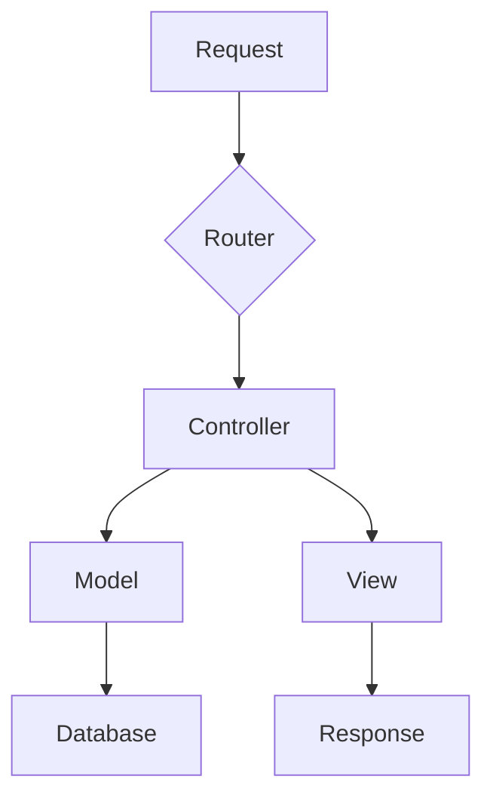

# 🚀 Router MVC Simple - Sistema de Enlaces

Autor: SinMasGato
Version del SW: PHP 8.2
19/11/2024


Un sistema de enrutamiento PHP moderno y eficiente con arquitectura MVC.


## 📑 Tabla de Contenidos
- [Instalación](#instalación)
- [Estructura](#estructura)
- [Uso](#uso)
- [Ejemplos](#ejemplos)
- [Configuración](#configuración)

## 🌟 Características Principales
- Sistema de rutas simple y potente
- Arquitectura MVC limpia
- URLs amigables
- Manejo de errores elegante
- Zero dependencias

## 🎯 Estructura del Proyecto
```
proyecto/
├── 📁 config/
    ├── Router.php
│   └── config.php
       # Configuración DB
├── 📁 controllers/
│   └── EnlaceController.php
├── 📁 models/
│   └── EnlaceModel.php
├── 📁 views/
│   ├── busqueda.php
│   └── error.php
                         # Sistema de rutas
├── .htaccess            # Configuración Apache
└── index.php            # Punto de entrada
```


## ⚙️ Instalación

### 1. Clonar Repositorio
```bash
git clone https://github.com/usuario/router-mvc.git
cd router-mvc
```

### 2. Configurar Apache (.htaccess)
```apache
RewriteEngine On
RewriteCond %{REQUEST_FILENAME} !-f
RewriteCond %{REQUEST_FILENAME} !-d
RewriteRule ^(.*)$ index.php?url=$1 [QSA,L]
```

### 3. Configurar Base de Datos
```php
// config/config.php
define('DB_HOST', 'localhost');
define('DB_NAME', 'enlaces');
define('DB_USER', 'root');
define('DB_PASS', '');
```


## 📝 Uso del Router

### Definir Rutas (index.php)
```php
$router = new Router();
$controller = new EnlaceController();

// Rutas GET
$router->get('', [$controller, 'index']);
$router->get('enlaces', [$controller, 'listar']);

// Rutas POST
$router->post('buscar', [$controller, 'buscar']);
```

### Ejemplo de Controlador
```php
class EnlaceController {
    private $model;

    public function __construct() {
        $this->model = new EnlaceModel();
    }

    public function index() {
        // Lógica página principal
        require 'views/index.php';
    }
    
    public function buscar() {
        $termino = $_POST['busqueda'] ?? '';
        $resultados = $this->model->buscar($termino);
        require 'views/resultados.php';
    }
}
```


## 🎯 Ejemplos de Uso

### 1. Página Principal
```php
// URL: /
$router->get('', [$controller, 'index']);
```

### 2. Búsqueda
```php
// URL: /buscar (POST)
$router->post('buscar', [$controller, 'buscar']);
```

### 3. Ver Enlaces por Categoría
```php
// URL: /categoria/php
$router->get('categoria/{id}', [$controller, 'categoria']);
```


## ⚡ Características Avanzadas

### Manejo de Errores
```php
// views/404.php
<!DOCTYPE html>
<html>
<head>
    <title>404 - No Encontrado</title>
</head>
<body>
    <h1>Página no encontrada</h1>
</body>
</html>
```

### Middleware (opcional)
```php
$router->middleware('auth', function() {
    // Verificar autenticación
});
```


## 📊 Diagrama de Flujo


## 🛠️ Requisitos
- PHP 7.4+
- Apache/Nginx
- mod_rewrite habilitado
- MySQL 5.7+

## 📜 Licencia
Este proyecto está bajo la Licencia MIT. Ver el archivo [LICENSE](LICENSE) para más detalles.

## 👥 Contribución
1. Fork el proyecto
2. Crea tu rama de características (`git checkout -b feature/AmazingFeature`)
3. Commit tus cambios (`git commit -m 'Add: nueva característica'`)
4. Push a la rama (`git push origin feature/AmazingFeature`)
5. Abre un Pull Request

## 📞 Soporte
- Email: sejodiotodoportuculpa@gmail.com

---
⭐️ ¡Si te gusta este proyecto, dale una estrella en GitHub! ⭐️
