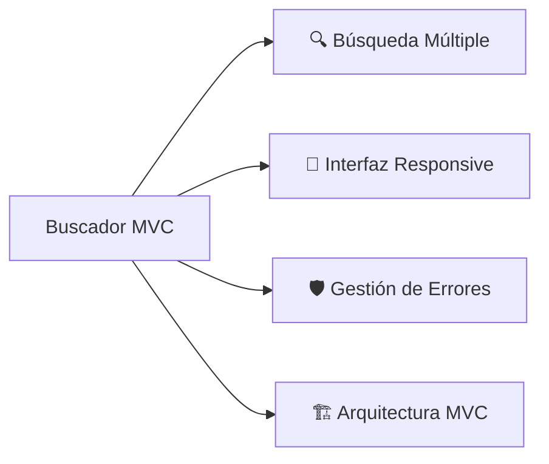
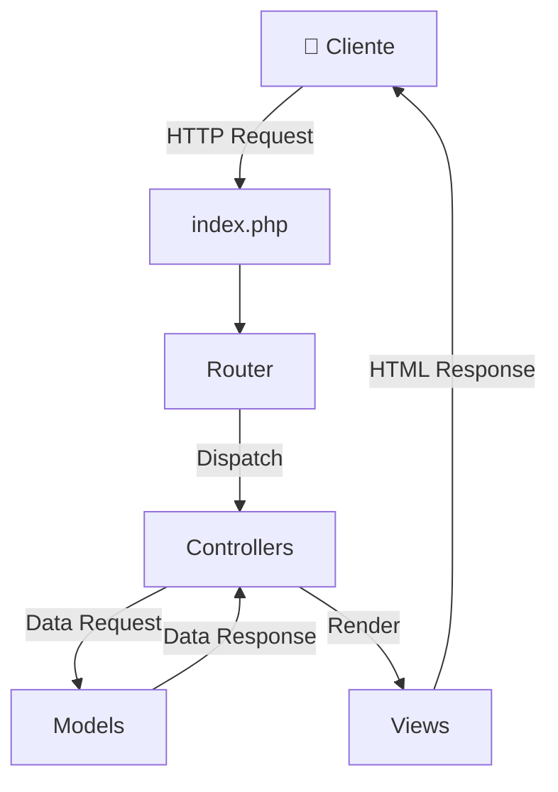
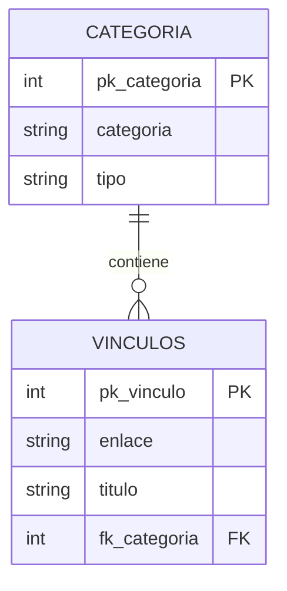
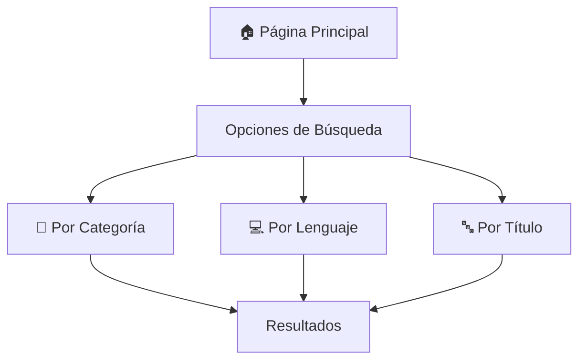
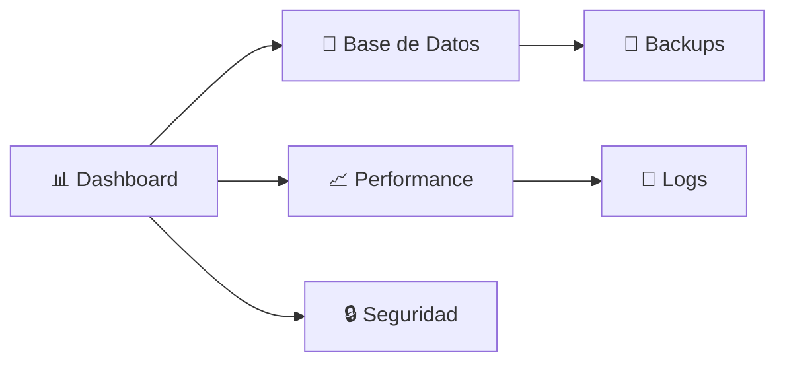

# 🔍 Buscador de Enlaces MVC
## Manual de Implementación y Documentación

Autor: Fredy Magaña  
Version: PHP 8.2  
Fecha: 19/11/2024

## 📑 Tabla de Contenidos
1. [Visión General](#visión-general)
2. [Arquitectura](#arquitectura)
3. [Instalación](#instalación)
4. [Componentes](#componentes)
5. [Manual de Usuario](#manual-de-usuario)
6. [Despliegue](#despliegue)
7. [Mantenimiento](#mantenimiento)

## 🎯 Visión General

### Objetivo
Desarrollar un buscador de enlaces modular y eficiente utilizando el patrón MVC en PHP.

### ✨ Características Principales


## 🏗️ Arquitectura

### Flujo de la Aplicación


### 📁 Estructura del Proyecto
```plaintext
enlaces-mvc/
├── 📂 assets/
│   ├── 📊 css/style.css
│   └── 📈 js/main.js
├── 📂 controllers/
│   ├── 🔄 Autoload.php
│   ├── 🎮 VistaController.php
│   └── 🎯 ResultadosController.php
├── 📂 models/
│   └── 💾 ModelBBDD.php
├── 📂 views/
│   ├── 📄 header.php
│   ├── 🔍 buscador.php
│   ├── 📋 resultados.php
│   └── 📄 footer.php
└── 📝 index.php
```

## ⚙️ Instalación

### Requisitos
- PHP 8.2+
- MySQL 8.0+
- Composer
- Apache/Nginx

### Base de Datos


### Código Principal

#### 🔄 ModelBBDD.php
```php
class ModelBBDD {
    private $conn;
    
    public function __construct() {
        try {
            $this->conn = new PDO(
                "mysql:host=localhost;dbname=enlaces1;charset=utf8",
                "root",
                "",
                [PDO::ATTR_ERRMODE => PDO::ERRMODE_EXCEPTION]
            );
        } catch(PDOException $e) {
            throw new Exception($e->getMessage());
        }
    }

    public function getEnlacesByCategoria($categoria) {
        $sql = "SELECT * FROM vista_enlaces WHERE categoria = ?";
        $stmt = $this->conn->prepare($sql);
        $stmt->execute([$categoria]);
        return $stmt->fetchAll(PDO::FETCH_ASSOC);
    }

    public function getEnlacesByTipo($tipo) {
        $sql = "SELECT * FROM vista_enlaces WHERE tipo = ?";
        $stmt = $this->conn->prepare($sql);
        $stmt->execute([$tipo]);
        return $stmt->fetchAll(PDO::FETCH_ASSOC);
    }

    public function getEnlacesByTitulo($busqueda) {
        $sql = "SELECT * FROM vista_enlaces WHERE titulo LIKE ?";
        $stmt = $this->conn->prepare($sql);
        $stmt->execute(['%' . $busqueda . '%']);
        return $stmt->fetchAll(PDO::FETCH_ASSOC);
    }
}
```

## 👤 Manual de Usuario

### Interfaz Principal


### Funcionalidades

#### 1️⃣ Búsqueda por Categoría
- Selector desplegable de categorías
- Filtrado instantáneo
- Visualización en tarjetas

#### 2️⃣ Búsqueda por Lenguaje
- Filtros predefinidos
- Resultados agrupados
- Ordenación automática

#### 3️⃣ Búsqueda por Título
- Campo de búsqueda en tiempo real
- Autocompletado
- Resaltado de coincidencias

## 🚀 Despliegue

### Configuración Apache
```apache
<VirtualHost *:80>
    ServerName enlaces-mvc.local
    DocumentRoot /var/www/enlaces-mvc
    <Directory /var/www/enlaces-mvc>
        AllowOverride All
        Require all granted
    </Directory>
</VirtualHost>
```

## 🛠️ Mantenimiento

### Monitoreo


### Tareas Periódicas
1. 🔄 Actualización de dependencias
2. 💾 Backup de base de datos
3. 📝 Revisión de logs
4. 🔒 Auditoría de seguridad

## 🤝 Contribuciones
1. Fork del repositorio
2. Crear rama (`feature/NuevaFuncionalidad`)
3. Commit (`git commit -m 'Añadir nueva funcionalidad'`)
4. Push (`git push origin feature/NuevaFuncionalidad`)
5. Pull Request

## 📜 Licencia
MIT License - Ver archivo `LICENSE`
